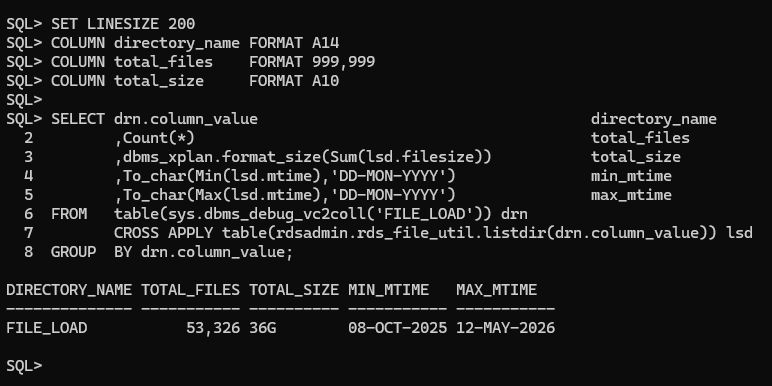
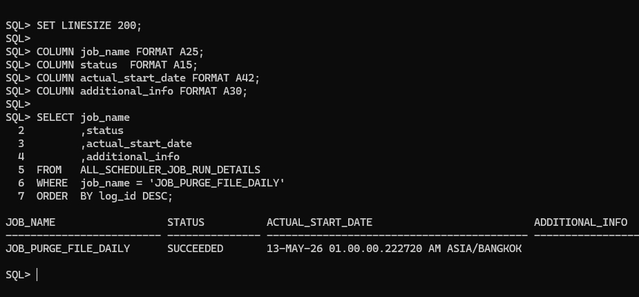

# Automate File Cleanup in Oracle 19c RDS via JSON-Driven Regex

> [!NOTE]
> This article covers a modern approach to directory maintenance using JSON-defined retention rules and CROSS APPLY.
>
> **Goal:** Centralize file retention logic within a JSON document for easier scalability and "Dry-Run" validation.

## TL;DR
* **Problem:** Managing disparate file patterns in procedural code is error-prone and difficult to audit before execution.
* **Solution:** A declarative engine using `JSON_TABLE` for policy definition and `CROSS APPLY` to audit storage consumption and purge expired files.
* **Key Command:** `CROSS APPLY table(rdsadmin.rds_file_util.listdir(drn.column_value))`

---

## 📑 Table of Contents
- [Prerequisites](#-prerequisites)
- [The Challenge](#-the-challenge)
- [Storage Consumption Audit](#-storage-consumption-audit)
- [Step-by-Step Implementation](#-step-by-step-implementation)
- [Troubleshooting and Best Practices](#troubleshooting-and-best-practices)

- [Summary](#-summary)

## 🛠 Prerequisites
- [ ] Oracle Database 19c (required for `JSON_TABLE` features)
- [ ] `EXECUTE` on `RDSADMIN.RDS_FILE_UTIL`
- [ ] `CREATE JOB` privilege for automation
- [ ] `SELECT` on `ALL_SCHEDULER_JOB_RUN_DETAILS` for monitoring


## 💡 The Challenge
Bridge the gap between "knowing" you have a storage issue and "fixing" it safely.
As a DBA, you must verify the impact of a purge script before it runs.
By using JSON to define rules, we ensure that **file_pattern is case-sensitive to prevent deleting the wrong files**.

## 📊 Storage Consumption Audit
Before executing any cleanup, it is critical to identify the storage high-water mark across your environment using the following logic:

*   **Dynamic Discovery**: Uses `sys.dbms_debug_vc2coll` to generate a virtual, in-memory collection of target directory names.
*   **Lateral Execution**: Employs the `CROSS APPLY` operator to perform a lateral join, triggering the `rds_file_util.listdir` function for every row in the collection.
*   **Set-Based Aggregation**: Consolidates file counts and total disk usage across multiple directories in a single, high-performance operation.

```sql
SET LINESIZE 200
COLUMN directory_name FORMAT A14
COLUMN total_files    FORMAT 999,999
COLUMN total_size     FORMAT A10

SELECT drn.column_value                                     directory_name
       ,Count(*)                                            total_files
       ,dbms_xplan.format_size(Sum(lsd.filesize))           total_size
       ,To_char(Min(lsd.mtime),'DD-MON-YYYY')               min_mtime
       ,To_char(Max(lsd.mtime),'DD-MON-YYYY')               max_mtime
FROM   table(sys.dbms_debug_vc2coll('FILE_LOAD')) drn
       CROSS APPLY table(rdsadmin.rds_file_util.listdir(drn.column_value)) lsd
GROUP  BY drn.column_value;

```

<p align="center">
  
  <br>
  <i>Figure 1: High-performance directory audit showing total file counts and 36GB storage consumption via rdsadmin.rds_file_util.</i>
</p>


## 🚀 Step-by-Step Implementation

### 1. The "Dry-Run" Audit Query (JSON-Table)
This query parses a JSON string to extract patterns.

**Note:** Use a double backslash (`\\`) as a JSON escape character for regex tokens.

```sql
/* Audit/Dry-Run Query using JSON_TABLE */
WITH t_rules AS (
    /*
       Note: file_pattern is case-sensitive to prevent deleting the wrong files.
       Regex patterns require double backslashes (\\) as JSON escape characters.
    */
    SELECT q'[ [
        {"file_pattern":"^INV_.*\\.csv$", "days_to_keep":"30"},
        {"file_pattern":"^LOG_.*\\.txt$", "days_to_keep":"3"},
        {"file_pattern":"^\\d{8}_.*",     "days_to_keep":"7"}
    ] ]' as json_data
    FROM dual
)
SELECT jt.file_pattern,
       TO_NUMBER(jt.days_to_keep) as retention_days,
       lsd.filename,
       lsd.mtime
FROM t_rules tr,
     JSON_TABLE(tr.json_data, '$[*]'
         COLUMNS (
             file_pattern PATH '$.file_pattern',
             days_to_keep PATH '$.days_to_keep'
         )
     ) jt
CROSS APPLY TABLE(rdsadmin.rds_file_util.listdir('FILE_LOAD')) lsd
WHERE lsd.type = 'file'
  AND REGEXP_LIKE(lsd.filename, jt.file_pattern) -- Case sensitive match
  AND lsd.mtime < (SYSDATE - TO_NUMBER(jt.days_to_keep));
```

### 2. The Automated Purge Job
The scheduler executes the filtered SQL result set, ensuring only validated files are passed to `UTL_FILE.FREMOVE`.

```sql
BEGIN
    DBMS_SCHEDULER.CREATE_JOB (
        job_name        => 'JOB_PURGE_FILE_DAILY',
        job_type        => 'PLSQL_BLOCK',
        job_action      => q'#
            BEGIN
                FOR r_file IN (
                    WITH t_rules AS (
                        SELECT q'[ [
                            {"p":"^INV_.*\\.csv$", "d":"30"},
                            {"p":"^LOG_.*\\.txt$", "d":"3"}
                        ] ]' as j FROM dual
                    )
                    SELECT lsd.filename
                    FROM t_rules tr,
                         JSON_TABLE(tr.j, '$[*]' COLUMNS (p PATH '$.p', d PATH '$.d')) jt
                    CROSS APPLY TABLE(rdsadmin.rds_file_util.listdir('FILE_LOAD')) lsd
                    WHERE lsd.type = 'file'
                      AND REGEXP_LIKE(lsd.filename, jt.p)
                      AND lsd.mtime < (SYSDATE - TO_NUMBER(jt.d))
                ) LOOP
                    BEGIN
                        UTL_FILE.FREMOVE('FILE_LOAD', r_file.filename);
                    EXCEPTION WHEN OTHERS THEN NULL;
                    END;
                END LOOP;
            END;
        #',
        start_date      => TRUNC(SYSTIMESTAMP) + 1 + 1/24,
        repeat_interval => 'FREQ=DAILY; BYHOUR=1',
        enabled         => TRUE
    );
END;
/
```

## 🛠Troubleshooting and Best Practices


| Error Code | Issue | Potential Cause | Recommended Fix |
| :--- | :--- | :--- | :--- |
| **ORA-29280** | Invalid Directory Path | The Directory Object name is misspelled or not created. | Check `ALL_DIRECTORIES` and ensure the name is passed in UPPERCASE. |
| **ORA-01031** | Insufficient Privileges | Access was granted via a Role instead of a Direct Grant. | Ensure the schema owner has *Direct Grants* (not via a Role) for `READ/WRITE` on the directory and `EXECUTE` on `RDSADMIN.RDS_FILE_UTIL` |


### Monitoring Scheduler Failures
To verify execution history, audit run times, and catch potential locking issues, query the scheduler run details view.

```sql
SET LINESIZE 200;

COLUMN job_name FORMAT A25;
COLUMN status  FORMAT A15;
COLUMN actual_start_date FORMAT A42;
COLUMN additional_info FORMAT A30;

SELECT job_name
       ,status
       ,actual_start_date
       ,additional_info
FROM   ALL_SCHEDULER_JOB_RUN_DETAILS
WHERE  job_name = 'JOB_PURGE_FILE_DAILY'
ORDER  BY log_id DESC;

```

<p align="center">
  
  <br>
  <i>Figure 2: Verifying a successful automated file lifecycle execution log within SQL*Plus.</i>
</p>


## 📊 Performance Verification


| Metric | Legacy PL/SQL Loops | JSON + SQL CROSS APPLY |
| :--- | :---: | :---: |
| **Configuration** | Scattered Variables | Centralized JSON |
| **Logic** | Procedural | Declarative (SQL) |
| **Safety** | Blind Execution | Dry-Run Capable |

## 🏁 Summary
By using `JSON_TABLE` to store metadata and `CROSS APPLY` for directory scanning, we've built a DBA toolkit that is both powerful and safe.
The ability to audit storage before and after the purge provides the visibility needed to maintain a high-performance Oracle RDS environment.

---
*Found a bug? Open an [Issue](https://github.com) or a PR!*
